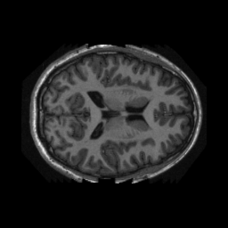
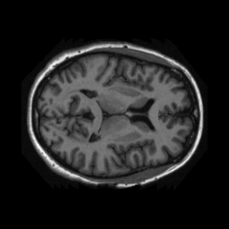
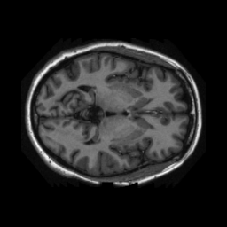
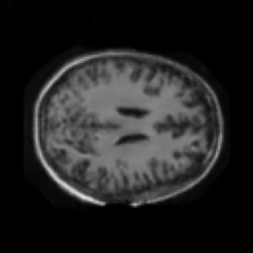
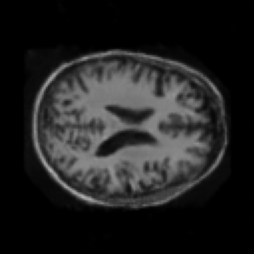
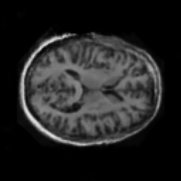

# Generative Adversarial Networks on OASIS dataset

## Overview

This Generative Adversarial Network's (GANs) application is to generate realistic like brain scans using the the Preprocessed OASIS dataset. This project is to explore the capabilities of GANs and working with High Performance Computing (HPC) Clusters, mainly UQ's Rangpur High Performance Computing Cluster and it's SLURM queuing system.

The preprocessed OASIS dataset was given, examples are attached below.

<p align="center">
  
  
  
</p>

Below are some examples of the GAN on the dataset:

<p align="center">
  
  
  
</p>

## Table of Contents

- [Generative Adversarial Networks on OASIS dataset](#generative-adversarial-networks-on-oasis-dataset)
  - [Overview](#overview)
  - [Table of Contents](#table-of-contents)
  - [File Structure](#file-structure)
  - [Installation](#installation)
  - [Requirements](#requirements)
  - [Usage](#usage)
  - [Contributing](#contributing)
  - [Conclusion](#conclusion)
  - [Future Improvements](#future-improvements)
  - [License](#license)

## File Structure

Folder contains the following files:

  - `train.py`: Main file to train the model.
  - `gan.py`: Contains the GAN model.
  - `dataset.py`: Contains the dataset class.


## Installation

1. Download preprocessed OASIS dataset from [here](https://www.oasis-brains.org/).
2. Clone the repository.
3. Install the required packages.
4. Run the code.


## Requirements

- Anaconda3 was used for it's intra-library compatibility and ease of use. The following packages are required to run the project:

| Package | Version |
| --- | --- |
|pytorch | 2.0.1 |
|torchvision | 0.15.2 |
|tqdm | 4.66.5 |
|numpy | 1.25.2 |
|matplotlib | 3.8.0 |
|pillow | 9.4.0 |

- Note: An NVIDIA GPU is advise to train the model.The model was trained on a NVIDIA A100 GPU with 40GB of memory and 64GB of RAM.

## Usage

Note: The following commands are to be run on the Rangpur HPC Cluster but can be modified to run on any other HPC Cluster. or local machine.

The Network is trained from scratch, no pre-trained model is used. To train the model, run the following command:

```
> python train.py
```

## Contributing


## Conclusion

Generative Adversarial Networks (GANs) are powerful tools capable of generating realistic data samples demonstrated with this project on the OASIS brain scan dataset. By training the model from scratch using UQ's Rangpur HPC cluster, it was able show the capabilities of GAN and produce visually convincing synthetic brain scans.

While the generated outputs exhibit promising visual resemblance to the original dataset, challenges such as mode collapse, training instability, and hyperparameter tuning were observed, reflecting common hurdles in GAN training. Taking advantage of the resources available from HPC like the NVIDIA A100 GPU, it was able to significantly accelerate the training process and enabling the computationally demanding model to be train in a short duration.

This project highlights the potential GANs in different fields like medical imaging, where synthetic data can support training deep learning models, augment datasets, and advance research. Future work on the project could focus on improving the model's output quality with clearer resolution. Other improves like implementing a more advance variant of GAN such as StyleGAN or Diffusion Models could be introduce. This project could be applicable to other disease classification or anomaly detection with future exploration.

Overall, this project servers as a foundation into explore the applications of GANs in medical imaging and highlights the importance of leveraging HPC resources for large-scale machine learning projects.


## Future Improvements

1. Enhancing Output quality 
2. Adding Loss Plot to help evaluate the training stability and convergence.
3. Hyperparameter Optimization
4. Improving model stability

## License

This project is licensed under the MIT License - see the [LICENSE](LICENSE) file for details.
